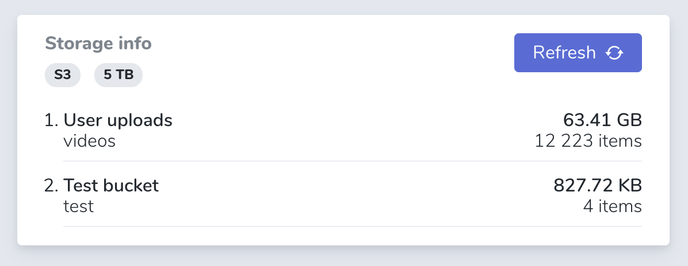

# nova-storage-info-card
Get basic information about the storage usage. Be sure, that you use **S3 driver fort that disk, that you adding to that card**

**Note, that you need to add disk to config/filesystem.php**



## Installation 

You can install the package into a Laravel app that uses Nova via composer:

```bash
composer require qubeek/nova-storage-info-card
```

##Usage

Register the card with Nova. To use the package, you need to indicate a disk meta in the format: the name of the container in Storage and the custom name.
In order to display the maximum disk size, write a memory meta which includes the maximum disk size.
For example:
```php
class NovaServiceProvider extends NovaApplicationServiceProvider

...

/**
 * Get the cards that should be displayed on the default Nova dashboard.
 *
 * @return array
 */
protected function cards()
{
    return [
        (new StorageInfoCard())
            ->disks([
                [
                    'title' => 'User uploads',
                    'disk_name' => 'video'
                ],
                [
                    'title' => 'Test',
                    'disk_name' => 'test'
                ]
            ])
            ->memory('5 TB')
    ];
}
```

## Tested filesystem types

- [Yandex (yandex-object-storage)](https://github.com/fLipE23/yandex-object-storage)
- [Basic S3 driver](https://laravel.com/docs/7.x/filesystem)
- [DigitalOcean space](https://www.digitalocean.com/products/spaces/)


## License

The MIT License (MIT). Please see [License File](LICENSE.md) for more information.
